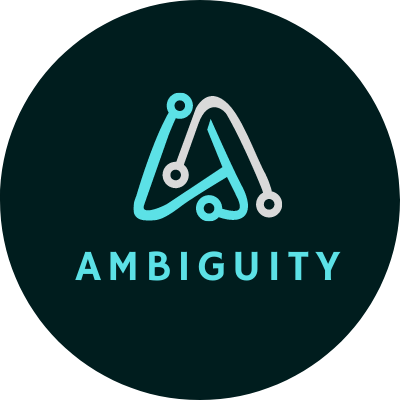
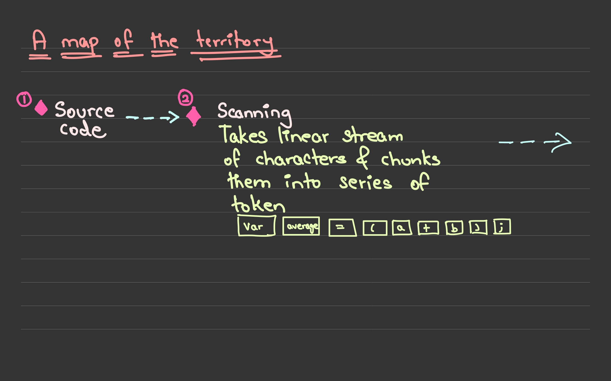
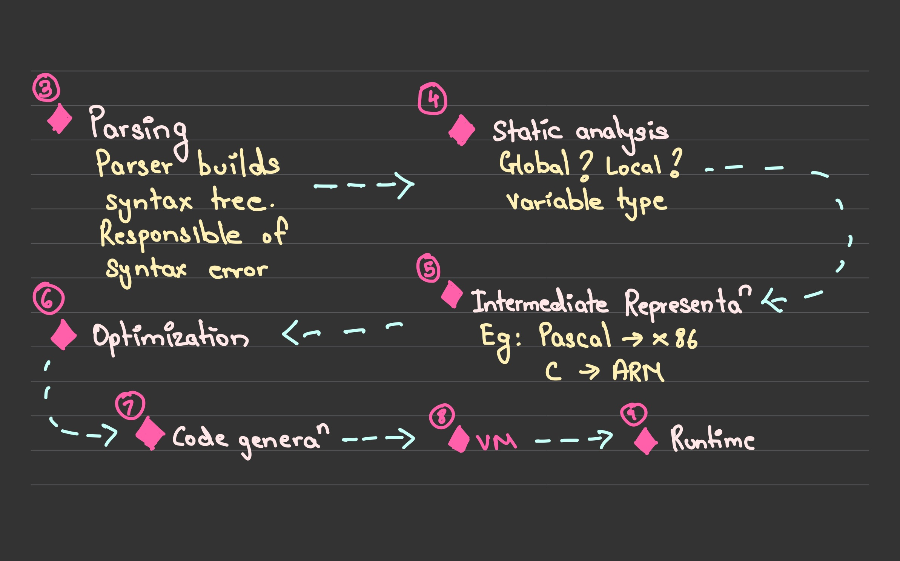

<div align="center"><h1>Ambiguity</h1></div>
<div align="center"></div>
<div align="center"><h3>The most ambiguous language</h3></div>


<pre><div align="center">      </div></pre> 


# Table of Content:

- [Process](#process)
- [Running the project](#running-the-project)
- [Stack in use](#stack-in-use)
- [Future scope](#future-scope)
- [Demo video](#demo-video)


## Process

<pre>
<div align="center">
</br>
</div>
</pre>


## Running the project
This project is probably the easiest to run. Yay for the judges ! Simple head over to the following repl
```
https://replit.com/@GottaCatchEmAll/Ambiguity-or-Mountain-Madness-2022
```
Now follow these steps 
- Press "Run"
- When prompted in the console , type RUN("m.amb")
- RUN will execute the m.amb file which includes code written in ambiguity language (extension is amb for ambiguity, get it?). You can play around write more statements and have fun 😉


Or if you are feeling fancy you can download the zip folder and run the code locally.


## Stack in use
- Python : Using an interpreted language to create a interpreted language , talk about meta.


## Future scope
- [x] Add return statement support for functions 
- [x] Add comments support
- [ ] Add ++ and - operators
- [ ] Add class and inheritance support
- [ ] Add better error handling
- [ ] Make a UI so that users can write code in Ambiguity


## Demo video
```
https://youtu.be/2ILurVypg_k
```
